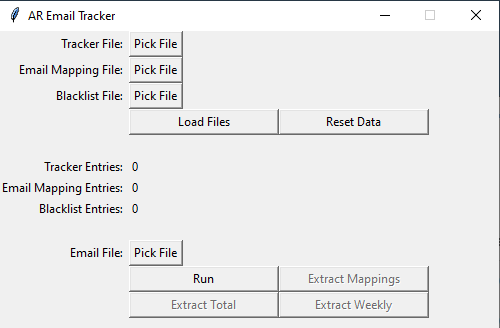

# AR Email Tracker

This is a program to help tabulate the emails interns get over the summer. It is currently a WIP, however for all intents and purposes it does work.

### Future Plans
* Use LLM's to help tag emails so AR Interns do not need to manually tag emails either
* Add customizable dates so we do not need to manually edit the code
* Add an output window instead of using console
* Add XLSX file support for trackers

## Installation

1. Install [Python 3.10](https://www.python.org/downloads/) or higher 
2. Run `install.bat` or navigate to the directory and run `python3 -m pip install -r requirements.txt` on the command line to install dependencies.

--- 

## Running the Program

Run `run.bat` or directly run the file `gui.py` in order to start the program. After running, you should see a window like this pop up:



### Tracker File

The tracker file is exactly what it says it is - it's an exported csv file from the trackers on the Sharepoint.

To actually export this file, go onto the `XX_Student_Upload` of each tracker and click `File -> Export -> Download this sheet as CSV (.csv)`. Alternatively, you can download each tracker individually if students added custom mappings in their notes column.

## Email Mapping File

The Email Mapping file is a `.json` file which maps the received email to the email on the tracker. This file contains all of the emails that we were unable to automatically map to any person. When first running the program, you will not have an email mapping file, but this is ok. After going through the process once, we generate one of these for future use. 

The file will look something like:
```json
{
  "recv_email": {
    "name": "Name",
    "map_email": "mapped_email"
  }
}
```

To actually update the file, replace the "mapped_email" with the email of the person on the tracker. Blank emails are ok, but they will be skipped in the program.

### Blacklist File

The Blacklist file is a `.txt` file that contains a list of ignored emails so they won't be counted in the weekly export. An example file is in `example_data/blacklist.txt`. You will most likely gain a list of these when you run the process once and generate the email mapping. 

### Load Files Button

Once you select the files (you do not need to select all of them), you can click this button to add the files to the program. You will need to do this before actually inputting any email data.

### Reset Data Button

This button is used to reset the entire program. You will be locked from adding any other files once you start adding email files, so click this if you realized you messed up. 

### Email File

The Email file is a `.pst` file export from classic outlook. You will need the desktop version of outlook (classic) since it's the only one that allows you to export your inbox contents. To export the file, click `File -> Open & Export -> Import/Export`. You will see this dialogue open up:


Then, click `Export to a file -> Outlook Data File (.pst) -> ArtSci Inbox (make sure Include Subfolders is checked) -> Finish`. If it asks you for a password, do not list any password. 

### Run Button

After loading your email file, click the `Run` button. You should see that some buttons are locked while others became unlocked. 

### Export Mappings Button

This button creates the file for the mappings that you will need for the `Email Mapping File` input.

### Extract Total Button

This button extracts the export for the total emails (basically how the tracker looks like).

### Extract Weekly Button

This button extracts the weekly emails received

---

## General Workflow

When first running the program, make sure that the start week & the number of weeks are correct. Check line 281 in `gui.py` to make sure that the numbers are correct. 

In the first round, I'd suggest adding the `tracker.csv` and the `blacklist.txt` first, and then click the run button. Then, add all of the `email.pst` files. Finally, click `Extract Mappings` button. 

Afterward, edit the mappings file that you just generated with the correct mappings, and also add any unwanted emails to the `blacklist.txt`.

In the second round, do what you did in the first round, but also add the `mappings.json`. You can now export total/weekly files. 